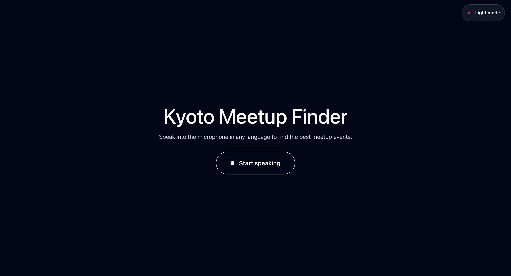
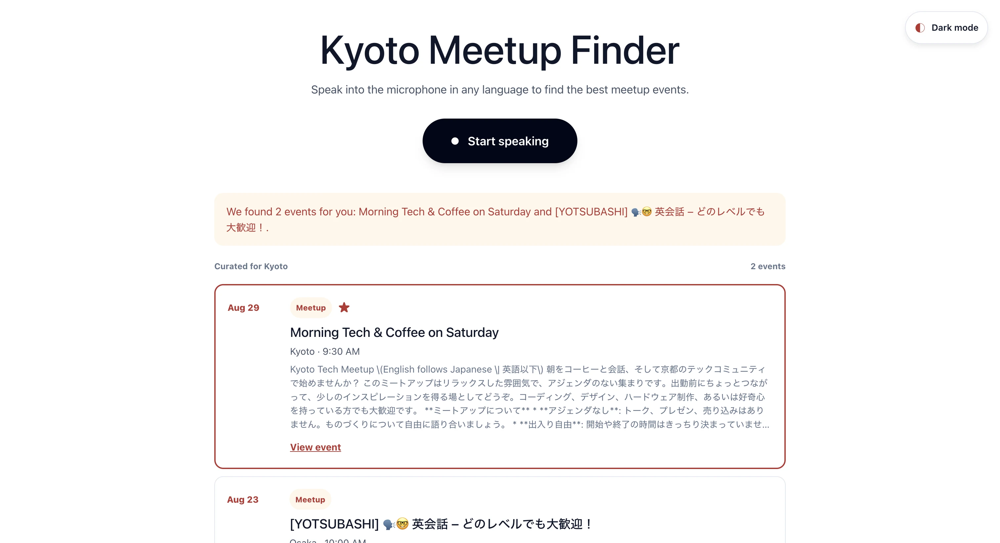
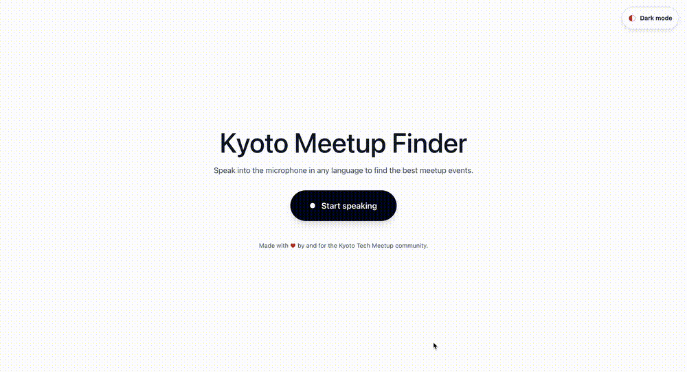

# Kan Scrape

Kan Scrape is a one-button event finder for Kyoto and the wider Kansai area. The frontend
records what you say, the backend transcribes the audio with local Whisper, refreshes real
event sources, and uses Mistral to select the best matches.

<p><em>Initial interface: one focused microphone action with the Kyoto Meetup Finder title.</em></p>


<p><em>Results interface: the voice request has returned event cards with dates, categories and links.</em></p>


<p><em>Interaction demo: start speaking, stop the recording and review the returned events.</em></p>


## Repository structure

```text
kan-scrape/
├── kan-scrape-front/   # React + TypeScript + Vite application
└── kan-scrape-back/    # FastAPI API, transcription, matching and event sources
```

## Setup, step by step

### 1. Install the requirements

Install Python 3.12+, [uv](https://docs.astral.sh/uv/), Node.js, pnpm and ffmpeg. On macOS:

```bash
brew install ffmpeg
```

### 2. Configure the backend

Create the environment file:

```bash
cd kan-scrape-back
cp .env.example .env
```

Edit `kan-scrape-back/.env`:

```env
# Required for real AI matching and the spoken pitch
MISTRAL_API_KEY=your_mistral_api_key

# Real event sources
FETCH_REMOTE_SOURCES=true
MEETUP_GROUPS=kyoto-tech-meetup,kyoto-language-interaction,kansaihikes

# Optional sources
DOORKEEPER_TOKEN=
CONNPASS_API_KEY=
```

The application starts without `MISTRAL_API_KEY`, but matching then uses a random-event
fallback. Meetup iCal feeds work without a key. Doorkeeper and Connpass are skipped until
their credentials are configured.

Never commit `.env` or put API keys in frontend files. The frontend optionally accepts a
backend URL in `kan-scrape-front/.env.local`:

```env
VITE_API_BASE_URL=http://localhost:8000
```

If VS Code reports that environment-file injection is disabled, reload the window after
enabling `python.terminal.useEnvFile`. The repository includes workspace settings pointing
Python at `kan-scrape-back/.env`; FastAPI also reads that file directly.

### 3. Install backend dependencies

From `kan-scrape-back/`:

```bash
uv sync
```

On Apple Silicon, optional Metal Whisper support is available with `uv sync --extra mlx`.
The first voice request may download the configured Whisper model. `large-v3-turbo` gives
better results but is large; use `WHISPER_MODEL=small` or `tiny` for a quicker local test.

### 4. Start the backend

From `kan-scrape-back/`:

```bash
uv run uvicorn app.main:app --reload
```

The API runs at [http://localhost:8000](http://localhost:8000), with interactive docs at
[http://localhost:8000/docs](http://localhost:8000/docs).

### 5. Refresh and verify real events

With the backend running, refresh all configured sources:

```bash
curl -s -X POST http://localhost:8000/api/events/refresh
curl -s 'http://localhost:8000/api/events?city=Kyoto&limit=10'
```

The refresh response reports the count per source. A healthy real setup should show seed events
and, when public feeds are reachable, Meetup events too.

### 6. Install and start the frontend

Open a second terminal from the repository root:

```bash
cd kan-scrape-front
pnpm install
pnpm dev
```

Open the Vite URL, normally [http://localhost:5173](http://localhost:5173). Ensure the backend
is running and `CORS_ORIGINS` includes the frontend URL.

After installing both applications, you can start the backend and frontend together from the
repository root. If port 5173 is occupied, Vite automatically selects the next available port:

```bash
pnpm dev
```

For testing from a phone on the same Wi-Fi network:

```bash
pnpm dev:lan
```

Stop both services with `Ctrl+C`.

To test from a phone on the same Wi-Fi network, start Vite on the LAN interface:

```bash
pnpm dev -- --host 0.0.0.0
```

Then set the computer's LAN address in `kan-scrape-back/.env`, for example
`CORS_ORIGINS=http://192.168.1.20:5173`, restart the backend, and open
`http://192.168.1.20:5173` on the phone. Do not use `localhost` on the phone because it refers
to the phone itself.

### 7. Run the checks

```bash
cd kan-scrape-back
uv run pytest -q
uv run ruff check .
uv run ruff format --check .

cd ../kan-scrape-front
pnpm lint
pnpm build
```

## Expected behaviour

1. The page opens with the title, description and one primary button. There is no page scroll.
2. Clicking `Start speaking` requests microphone permission, records browser audio and changes
   the button to `Stop and search`.
3. While speaking, the button indicator reacts only to the live microphone level and stays still
   during silence.
4. Clicking `Stop and search` stops recording, releases the microphone and shows `Searching…`
   with a loader.
5. The frontend sends WebM/Opus audio to `POST /api/match/voice`.
6. The backend loads Whisper locally, detects the spoken language and transcribes the request.
7. The backend considers upcoming, deduplicated events from configured sources and sends the
   best candidates to Mistral.
8. With a valid `MISTRAL_API_KEY`, Mistral selects one to three matching events and writes a
   short pitch in the user's language. The response has `mode: "match"`.
9. Without Mistral, with an unavailable model, or with an empty transcript, the API still
   responds with a real upcoming event and `mode: "random"`.
10. The result appears on the same page with pitch, title, date, time, location, description and
    a link to the original event when available.
11. Success, input and recoverable failures appear as light-theme Sonner toasts in the top-right.
12. `/api/speech` provides edge-tts audio when requested; if it is unavailable, the browser can
    be used as a fallback.

## Useful API checks

```bash
curl -s http://localhost:8000/api/health
curl -s http://localhost:8000/api/transcribe/status
curl -s -X POST http://localhost:8000/api/match/text \
  -H 'content-type: application/json' \
  -d '{"query":"I want a Python meetup in Kyoto this weekend"}'
```

For the complete endpoint and configuration reference, see
[kan-scrape-back/README.md](./kan-scrape-back/README.md).

## Project documentation

- [Design system](./DESIGN.md)
- [Agent instructions](./AGENTS.md)
- [Contributing](./CONTRIBUTING.md)

## License

This project is distributed under the [MIT License](./LICENSE).
